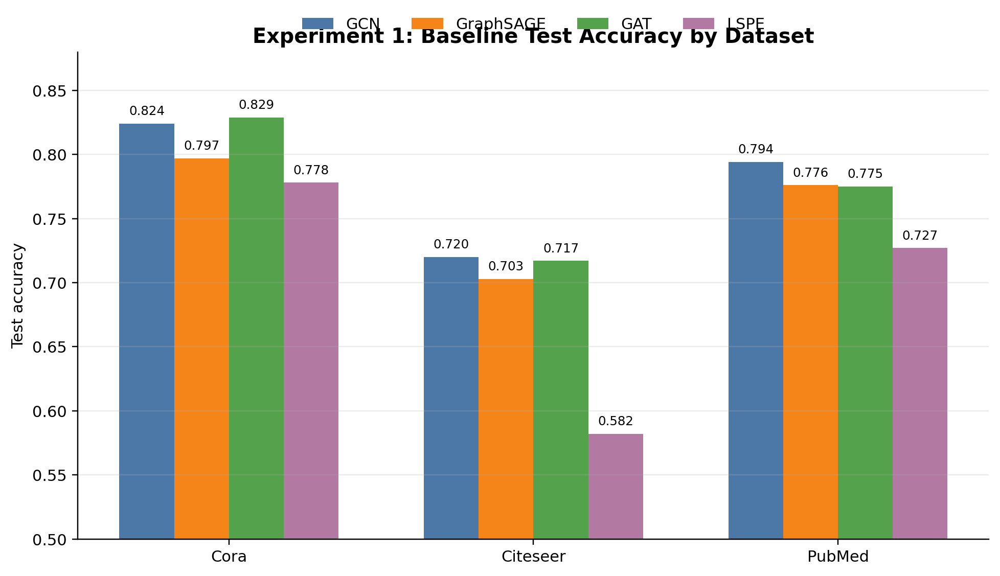
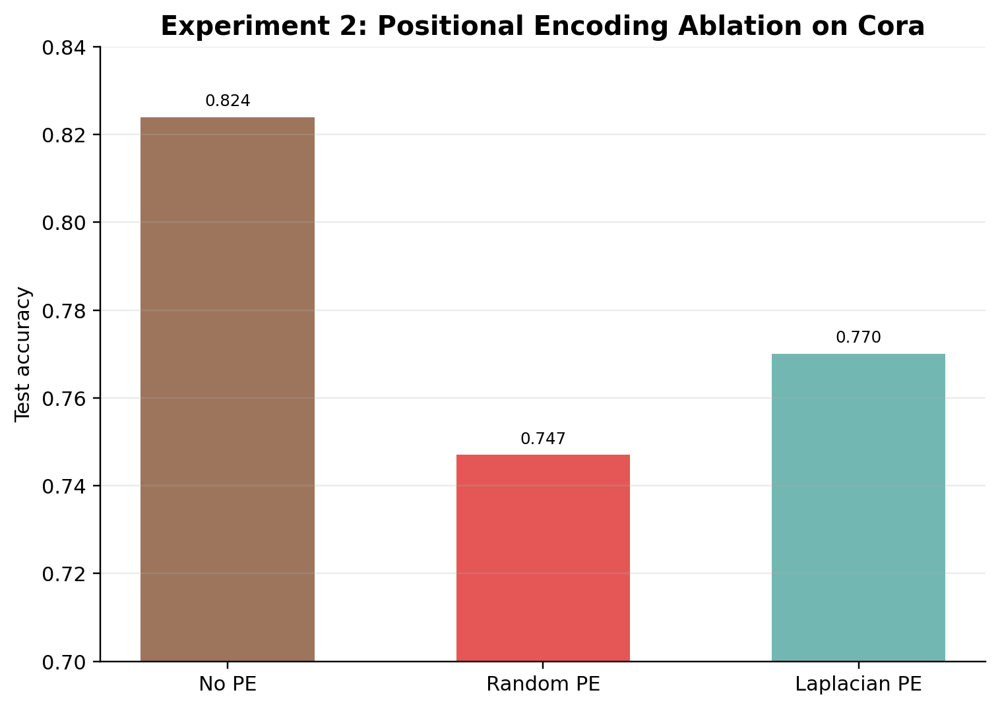
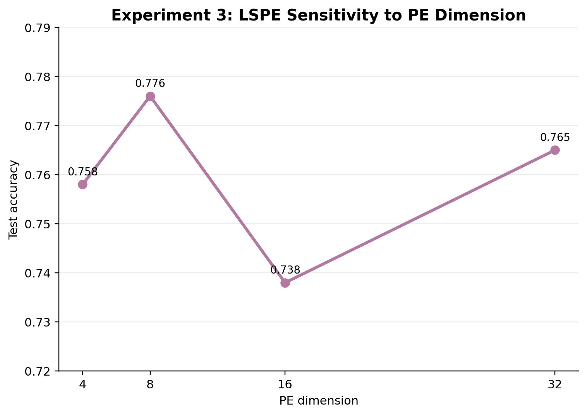
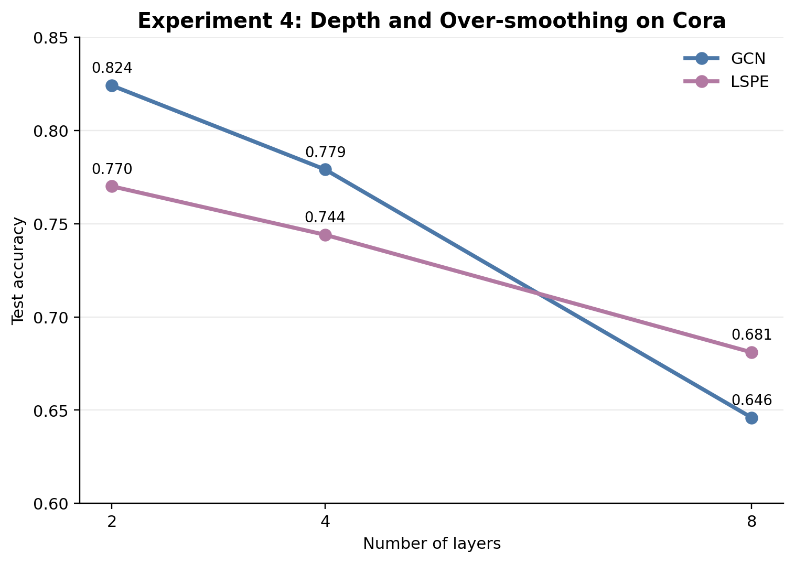
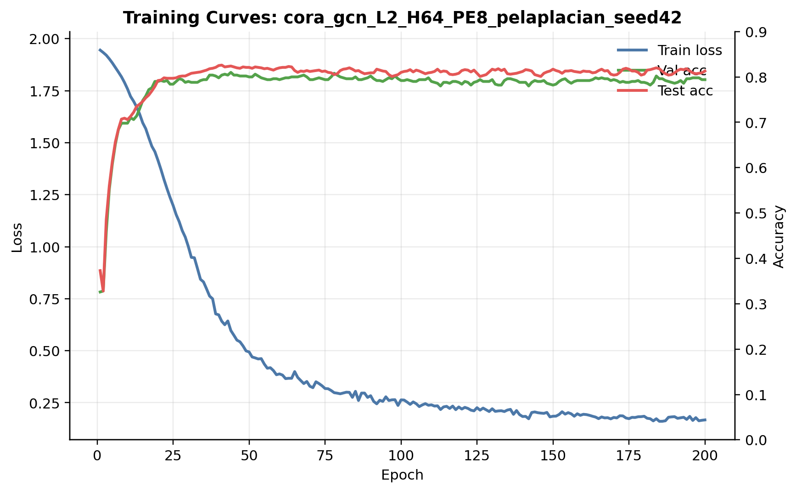
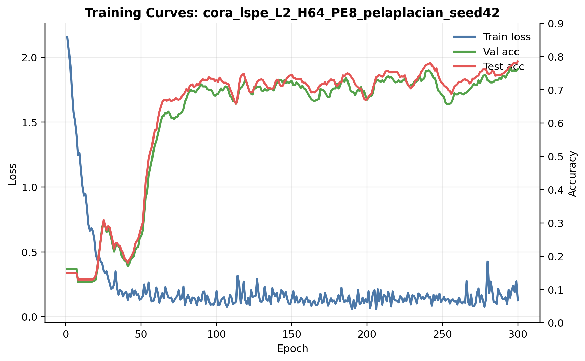
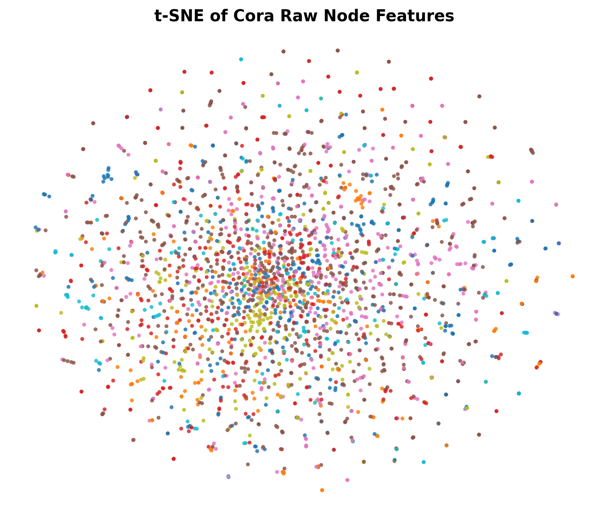
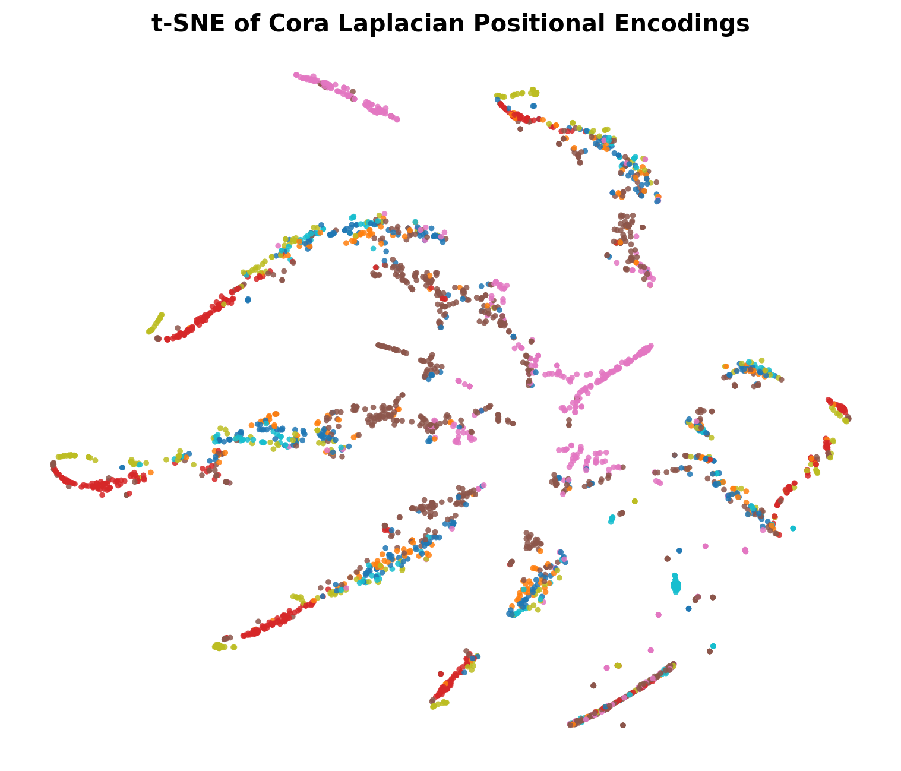

# Evaluating Learnable Structural and Positional Encodings in Graph Neural Networks

This project evaluates whether learnable structural and positional encodings improve node classification in Graph Neural Networks. We compare standard message-passing baselines against an LSPE-GCN model inspired by Dwivedi et al., "Graph Neural Networks with Learnable Structural and Positional Representations" (NeurIPS 2022).

The experiments use the Planetoid citation benchmarks: Cora, Citeseer, and PubMed.

## Team

<<<<<<< HEAD
- Sathwik – 23B0946
- Dinesh - 23B1022
- Rithvik - 23B0939
- Sujay - 23B1059
---
=======
| Member | Responsibility |
|---|---|
| Sathwik | Dataset loading, training infrastructure, GCN baseline |
| Dinesh | Experiment support |
| Rithvik | GraphSAGE, GAT, LSPE-GCN implementation |
| Sujay | Experiments, result tables, visualizations |
>>>>>>> 3688bbf (Add experiment results and update visualizations)

## Models

| Model | Description |
|---|---|
| GCN | Graph Convolutional Network baseline |
| GraphSAGE | Mean aggregation baseline |
| GAT | Attention-based graph baseline |
| LSPE | GCN-style model with separate learnable feature and positional streams |

LSPE uses Laplacian positional encodings stored as `data.pe`. The positional stream is updated separately at each layer, and the final classifier uses the learned node feature stream.

## Repository Structure

```text
datasets/                 Dataset loading and PE utilities
models/                   GCN, GraphSAGE, GAT, and LSPE implementations
training/                 Training loop, evaluation, result saving
experiments/configs/      YAML configs for all model/dataset runs
experiments/results/      CSV results, tables, and training histories
visualizations/plots.py   Main plotting script
visualizations/tsne.py    Optional t-SNE visualizations
visualizations/figures/   Generated figures
main.py                   Experiment entry point
```

## Setup

Create and activate a Python environment, then install dependencies:

```bash
python3 -m venv .venv
source .venv/bin/activate
pip install -r requirements.txt
```

If PyTorch Geometric wheel installation needs a CUDA-specific command on your machine, follow the official PyG install selector, then rerun the requirements command.

Verify the setup with a single Cora run:

```bash
python main.py --config experiments/configs/cora_gcn.yaml
```

Results are appended to `experiments/results/summary.csv`, and per-epoch histories are saved as `.npy` files in `experiments/results/`.

## Running Experiments

Run the full baseline sweep:

```bash
bash experiments/run_exp1_baselines.sh
```

Run the PE ablation:

```bash
bash experiments/run_exp2_pe_ablation.sh
```

Run the PE dimension study:

```bash
bash experiments/run_exp3_dim_study.sh
```

Run the depth analysis:

```bash
bash experiments/run_exp4_depth.sh
```

Generate result plots:

```bash
python visualizations/plots.py
```

Generate optional t-SNE plots:

```bash
python visualizations/tsne.py
```

## Results

Full detailed tables are available in `experiments/results/tables.md`. The main baseline comparison is:

| Dataset | GCN | GraphSAGE | GAT | LSPE |
|---|---:|---:|---:|---:|
| Cora | 0.824 | 0.797 | **0.829** | 0.778 |
| Citeseer | **0.720** | 0.703 | 0.717 | 0.582 |
| PubMed | **0.794** | 0.776 | 0.775 | 0.727 |
| Mean | **0.779** | 0.759 | 0.774 | 0.696 |

Values are test accuracy at the best validation epoch.

### PE Ablation on Cora

| Condition | Model | Test Acc |
|---|---|---:|
| No PE | GCN | **0.824** |
| Laplacian PE | LSPE | 0.770 |
| Random PE | LSPE | 0.747 |

Laplacian PE improved over random PE by 0.023 test accuracy, but the LSPE variant did not outperform the tuned GCN baseline on Cora.

### PE Dimension Study on Cora

| PE Dim | Test Acc |
|---:|---:|
| 4 | 0.758 |
| 8 | **0.776** |
| 16 | 0.738 |
| 32 | 0.765 |

The best LSPE result used `pe_dim=8`. Larger PE dimensions increased runtime and parameters without improving accuracy.

### Depth Analysis on Cora

| Model | 2 Layers | 4 Layers | 8 Layers | Drop from 2 to 8 |
|---|---:|---:|---:|---:|
| GCN | 0.824 | 0.779 | 0.646 | -0.178 |
| LSPE | 0.770 | 0.744 | 0.681 | -0.089 |

GCN was stronger at 2 layers, but LSPE degraded less as depth increased. This supports the idea that positional information can help reduce depth-related over-smoothing, even though the shallow LSPE model was not the best classifier overall.

## Figures

### Baseline Accuracy



### Positional Encoding Ablation



### PE Dimension Study



### Depth Analysis



### Training Curves





### t-SNE Visualizations





## Final Report Summary

### Research Question

Do learnable structural and positional encodings improve node classification compared with standard GNN message passing on citation graphs?

### Method

We implemented GCN, GraphSAGE, GAT, and LSPE-GCN in a shared training pipeline. Each model was evaluated on Cora, Citeseer, and PubMed using validation accuracy for model selection and test accuracy for final reporting. Additional controlled experiments tested PE type, PE dimension, and model depth.

### Findings

GAT achieved the best Cora result, while GCN achieved the best Citeseer and PubMed results. In this implementation and tuning budget, LSPE did not outperform the strongest shallow baselines. However, Laplacian PE was better than random PE, showing that the structure of the positional signal matters. The depth study showed that LSPE lost less accuracy from 2 to 8 layers than GCN, suggesting better robustness to over-smoothing.

### Limitations

The Planetoid splits have very small training sets, which makes larger models harder to optimize. LSPE also introduces extra parameters and runtime, especially on Citeseer. More seeds, broader hyperparameter tuning, checkpointed embedding analysis, and additional datasets would be needed for stronger conclusions.

### Conclusion

Learnable positional encodings were useful in the ablation and depth settings, but they were not enough to beat tuned shallow baselines in the main benchmark comparison. The most promising result is the depth behavior: LSPE retained more accuracy at 8 layers, which aligns with the motivation for structural and positional information in deeper GNNs.

## Reference

Dwivedi, V. P. et al. Graph Neural Networks with Learnable Structural and Positional Representations. NeurIPS 2022.

Paper: https://arxiv.org/abs/2110.07875
